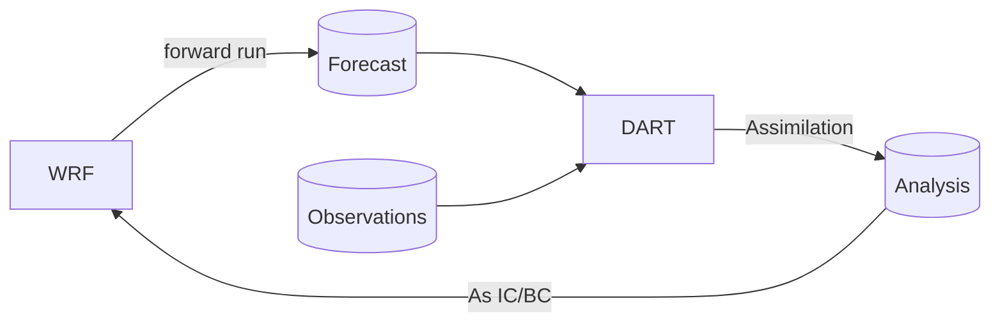
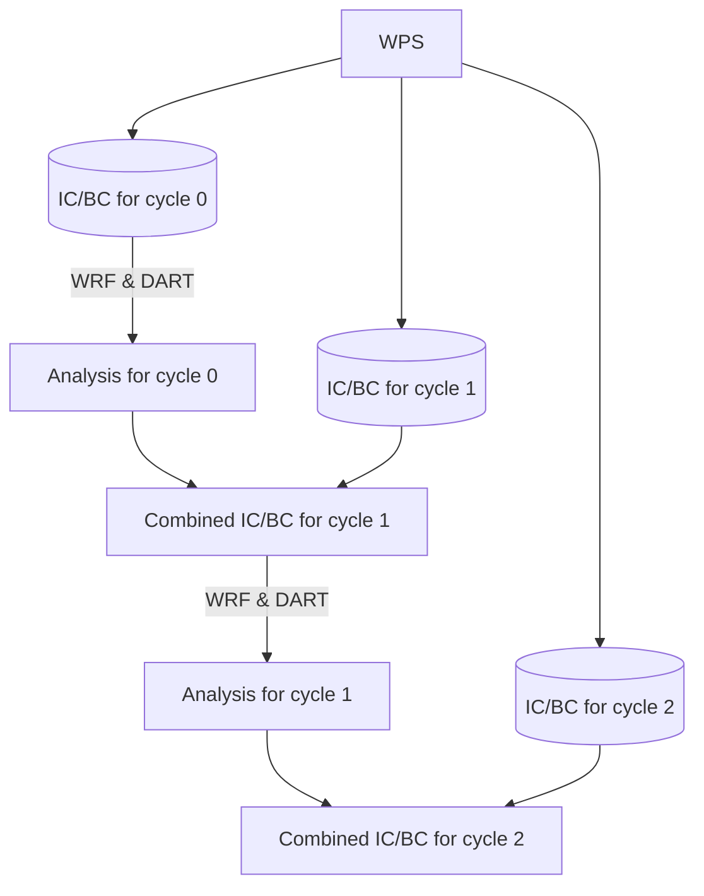
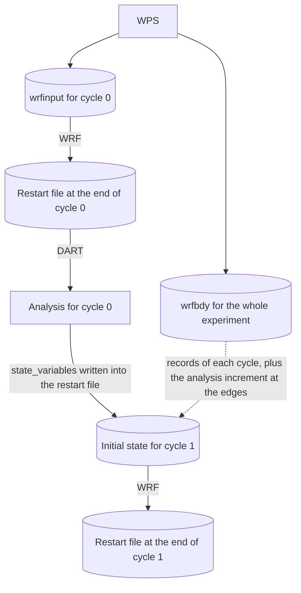
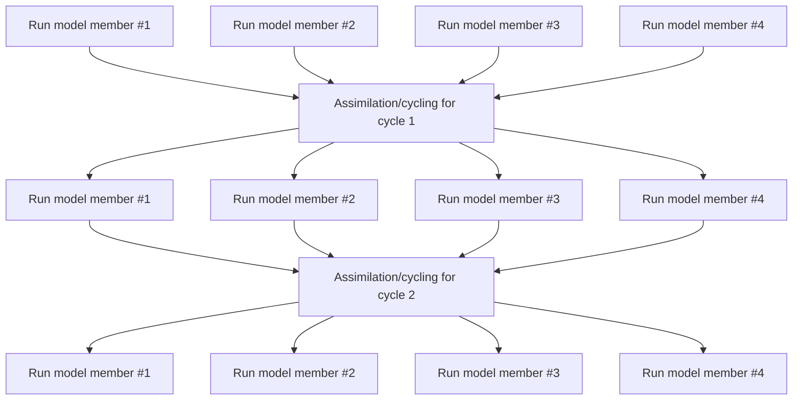

# Core Concepts

WRF ensembly is made available as a command line tool, which can be accessed with `wrf-ensembly` after installation. All activities are managed through **Experiments**, which are represented by a *directory* that holds all configuration, data and model binaries needed for one assimilation experiment. In general, all commands follow the pattern:

```bash
wrf-ensembly $EXPERIMENT_PATH group command
```

where `$EXPERIMENT_PATH` is the path to the experiment directory and `group`/`command` signals the action you want to execute.

Experiments follow the general 'Setup, Preprocessing, Assimilation, Postprocessing' steps. Each step is managed through a separate group of commands.


## Cycling

WRF Ensembly is a cycling assimilation system based on [NCAR DART](https://dart.ucar.edu). With *cycling*, we refer to the act of running a forward run of the NWP model and then using its output as input for the next forward run. One *cycle* of an *experiment* refers to one forward run and the subsequent assimilation.



Since the system is an **Ensemble** assimilation system, the forward run is actually a set of forward runs, one for each member of the ensemble. Then, DART is used to produce the analysis (for all members) and you can optionally use ensembly to get ensemble statistics (e.g. mean, spread).

Optionally, a cycle can use the forecast to move forward, in case the analysis doesn't
exist. For example, when there aren't any data to assimilate.

How a member continues into the next cycle depends on `assimilation.cycling_mode`, see
[Cycling modes](./configuration.md#cycling-modes) for the settings.

### `wrfinput` mode: a fresh start every cycle

WRF's output doesn't include everything needed to start the model (SST, for example, is
not advanced by the model but is needed to initialise it). So real.exe makes initial and
boundary conditions for every cycle's start, and at the end of each cycle the analysis is
combined with the ones for the next cycle:



Only the `cycled_variables` come from the analysis; everything else is fresh from real.exe.
WRF starts cold every cycle, so physics state that isn't in the wrfinput (cloud droplet
number, TKE, accumulated fields, ...) starts over each time.

### `restart` mode: members continue from their own restart file

real.exe runs once, for the whole experiment: it makes the first cycle's wrfinput and one
wrfbdy for the whole period. Every member writes a WRF restart file at the end of each
cycle, which holds its complete state, and starts the next cycle from it:



`ensemble cycle` writes only the analysis' `state_variables` into the restart file and
rebalances pressure and density; everything else carries over as WRF left it. Each member
gets the boundary records of its cycle from the long wrfbdy, and `ensemble update-bc` adds
the analysis increment at the domain edges to them. When a cycle has no observations,
the restart file is used as it is, so the run continues as if it had never stopped (with
the exceptions below).

#### What a restart doesn't carry over exactly

A WRF restart is close to exact but not bitwise. Differences are tiny compared to
ensemble spread, but they show up when comparing runs:

- Fields WRF doesn't write to restart files start over at 0, for example `EDUST1`-`EDUST5`
  and `TOT_EDUST` with GOCART dust, which then hold the emissions since the last restart
  instead of since the experiment start. Fields that are restarted, like `RAINNC` and the
  deposition fluxes, keep counting from the experiment start.
- With the adaptive time step, WRF-Chem stores the time of its last chemistry step in
  whole seconds, so the first chemistry step after a restart is up to a second too long.
  This shifts OC/BC between their hydrophobic and hydrophilic forms slightly at every
  restart. Dust and sea salt are not affected.
- The meteorology can drift apart at round-off level after some restarts (seen with
  WRF-Chem and aerosol-aware microphysics, starting at the lateral boundary), and grow
  where clouds form or not. It isn't predictable which restarts do this.

[Segments](#segments) avoid most restarts, so they also avoid most of this.

### Segments

In the `restart` cycling mode, moving forward with the forecast changes nothing in the
model state, yet each stop still costs restart I/O and a round trip through the queue.
With [`[segments]`](./configuration.md#segments) enabled, the members run several cycles
as one WRF run, a *segment*, and only stop where it's needed:

- at a cycle with an observation file in `obs/` (where the filter runs), so run
  `observations prepare-cycles` before starting the experiment;
- at the cycles in `assimilation.keep_restart_files_for_cycles`;
- at the `--run-until` cycle of `slurm run-experiment`;
- at the last cycle;
- or earlier, if the run would not fit in `segments.max_walltime`.

The cycle stays the unit of everything else: each cycle still gets its own forecasts,
status files and postprocessing, so commands that take a cycle work as before. A segment
is planned when it is about to start (by `ensemble setup` and `ensemble cycle`) and the
plan is stored in `status/segments/`. `ensemble plan-segment` shows it, or plans it again
with `--replan` as long as no member has started.

While a segment runs, the experiment stays at its first cycle. Afterwards, every member
has sorted its output into the cycles it belongs to, and `ensemble finish-segment` (the
first step of the analysis job) marks the inner cycles complete and moves the experiment
to the last one, where filter, analysis and cycle run as usual.

Members write a restart file every `checkpoint_interval_hours` along the way. If a
member job dies, `run-experiment` resubmits it as usual and it continues from its newest
checkpoint that WRF finished writing. `ensemble reset-cycle` on any cycle of the segment
resets the whole segment, deleting its output and checkpoints, and plans it again.

## Experiment Directory Structure

The experiment directory is the main directory where all data and configuration files are stored. It is structured as follows:


  - `data/` - Input files & final output files
    - `analysis/`
    - `diagnostics/` - DART obs_seq.out files, IC/BC perturbations
    - `forecasts/` - Postprocessed wrfout files
    - `initial_boundary/` - wrfinput and wrfbdy files
  - `jobfiles/` - SLURM jobfiles
  - `logs/` - Log files, one subdirectory per executed command
    - `slurm/` - stdout of SLURM jobs
  - `obs/` - Observations (.toml and .obs_seq)
  - `scratch/` - Temporary files (but also raw wrfout)
    - `analysis/`
    - `dart/` - DART output files (netCDF only w/ state vars.)
    - `forecasts/` - raw wrfout files from model
    - `postprocess/` - Used during post-processing
    - `restart/` - WRF restart files per cycle and member (`restart` cycling mode), and
      the checkpoints of a running segment with `checkpoints.json`
  - `work/` - WRF/WPS executables and working directories
    - `ensemble/` - One subdirectory per ensemble, contains wrf.exe
    - `preprocessing/` - A copy of WRF and WPS used to generate the IC/BC
    - `WPS/` - The WPS build used for the experiment
    - `WRF/` - The WRF build used for the experiment
  - `status/` - Experiment status, see [Experiment status tracking](#experiment-status-tracking)
  - `config.toml` - Configuration file for the experiment

The `scratch/` directory can get pretty large in size because of the wrfout files. You can set move this directory outside of the experiment path, possibly on a different mountpoint. This is to accomodate HPC systems that provide a larger scratch mountpoint.


## Logging

Everytime a command is executed, a subdirectory is created inside the `logs/` directory, following this naming scheme:

```
YYYY-MM-DD_HHMMSS-COMMAND
```

For example, `2024-12-31_235959-experiment-create` would be created when running `experiment create` on 2024-12-31, at 23:59:59. Inside the subdirectory, there is always a file called `wrf_ensembly.log` that contains all output of ensembly. If any external commands were used (i.e. `ungrib.exe`), then the output of the command in stored in a second file (i.e. `ungrib.log`).

There is a special case for the `rsl.*` files created by WRF. Because you have 2 files per CPU core and you create new files every cycle, for each member, it can easily add up and hit file-count quotas on certain HPC systems. Thus, only the first rsl files are available in plain-text (`rsl.out.0000` and `rsl.error.0000`). The rest of the files are compressed and stored in the same directory.


## Observations

Observations are stored inside the `obs/` category per-experiment. DART requires observations to be in `obs_seq` format and provides a set of `obs_converters` to do this. Since you would need one `obs_seq` file per assimilation cycle, including all observations you need (possibly from different instruments), WRF-Ensembly tries to automate this process by having scripts to browse available observations and then convert only the required ones. This is a per-observation-type workflow and might need the user to write a custom script to find available observations.

The whole abstraction is entirely optional. WRF-Ensembly will use any `obs_seq.cycle_X` available inside the `obs/` directory. More information in the [Observations](./observations.md) section.


## Configuration

Experiments are configured through the `config.toml` file, in [TOML format](https://toml.io/en/). Currently, this includes all WRF-Ensembly settings and the WRF/WPS namelists. DART configuration is not handled. More information in the [Configuration](./configuration.md) section.


## Postprocessing

In the typical WRF-Ensembly workflow, we don't use the raw wrfout files. The following steps are followed before you get the output **forecast**/**analysis** files:

1. Use [xwrf](https://github.com/xarray-contrib/xwrf) to make the files a bit more convenient (shorter dimension names, some diagnostics computed, CF-compliant attributes added). Remove any uneeded variables to save space.
2. Optionally, apply any external processors on the files.
3. Concatenate all files into a single file, one per cycle and member.
4. Compute the ensemble statistics (mean and standard deviation), leaving you with two files per cycle.

During the final steps, the files are also compressed using a netCDF-compatible algorithm (zstd is recommended, but zlib is more widely available) and the variables are 'packed' to avoid storing too many insignificant digits. Both these processes are optional and configurable (see the `[postprocess]` section of the [Configuration](./configuration.md#postprocess)). The user can select whether to store only the ensemble statistics or all member files, the first cutting down the output size significantly.

Because there are many tools that use raw wrfout files, the above is all optional. You can find the wrfout files inside the `scratch/` directory.

More information about postprocessing is available in the [Postprocessing](./postprocess.md) section, including how the processing pipeline is setup.


## HPC intergration (SLURM)

For use in HPC environments, WRF-Ensembly heavily relies on SLURM for job scheduling. This is an optional convenience feature, as you can completely use WRF-Ensembly without a scheduling system.
Jobfiles can be generated for many time-intensive tasks (i.e. pre-processing with WPS or postprocessing with WRF-Ensembly) and for running the assimilation experiment. In this last scenario, WRF-ensembly uses dependencies to run the assimilation/cycle step after the model has advanced, which then queues the next cycle. The example below shows a flowchart for an experiment with 4 members. Each box represents a SLURM job.



This feature allows the user to run experiments fully parallelized, with each WRF execution taking place in a different node (as long as there are available resources), while only requiring N+2 queued jobs at any time, where N is the number of members. This is useful in systems where there are max-queued job limits.

If for any reason the experiment is interrupted, it can be resumed without re-running any completed steps.

With [segments](#segments), each "Run model member" job runs a whole segment, and its
time limit follows the segment's length.


## Experiment status tracking

The status of the experiment is tracked through the `status/` directory, which stores the current cycle, which members have been advanced (i.e. WRF successfully completed), whether the assimilation filter has been completed, and some statistics about how long it took to advance each member. There is a set of commands available for working with it (`wrf-ensembly status`), described in the [Status](./usage.md#status) section.

The layout is one small file per fact:

```
status/
  experiment.json                       # {"version": 1, "current_cycle": 5}
  cycles/cycle_000/
    members/member_00.json              # advancement and runtime of one member
    filter_complete                     # marker files; existence means done
    analysis_complete
    cycle_complete
    ops/apply_perturbations             # optional operation markers
  segments/cycle_004.json               # plan of the segment starting at cycle 4
```

Every file has exactly one writer and is written atomically, so no locking is involved anywhere. This matters because ensemble members advance as separate jobs on separate nodes, often on a shared filesystem where the locking that a database needs is unreliable or slow. Members writing their own files in parallel cannot collide, and everything else is written by a single serial command.

The state of a cycle is not stored directly, it is worked out from these files: a cycle with no member files is `initialized`, one with some is `advancing_members`, one where every member has a file is `members_advanced`, and beyond that the marker files take over. This means the status can never disagree with itself, and a member finishing in another process is picked up immediately.

Everything is plain text, so you can inspect an experiment with `ls` and fix one by hand:

```bash
# How far along is cycle 12?
ls $EXPERIMENT/status/cycles/cycle_012/members | wc -l

# Re-run member 7 of the current cycle
rm $EXPERIMENT/status/cycles/cycle_012/members/member_07.json
```

If the status and the actual model output have drifted apart (for example a job was killed between WRF finishing and the result being recorded), `wrf-ensembly $EXPERIMENT status reconcile` rebuilds the member advancement of a cycle from the forecast files on disk. Pass `--dry-run` first to see what it would change.


# What to read next

The [Installation](./installation.md) page details how to get WRF-Ensembly installed on your system, including dependencies or for development. The [Usage](./usage.md) page details all commands available in WRF-Ensembly and their usage, including on how to setup your first experiment. The [Configuration](./configuration.md) page details how to configure your experiment, including the WRF/WPS namelists. Information about observations is available in the [Observations](./observations.md) page.